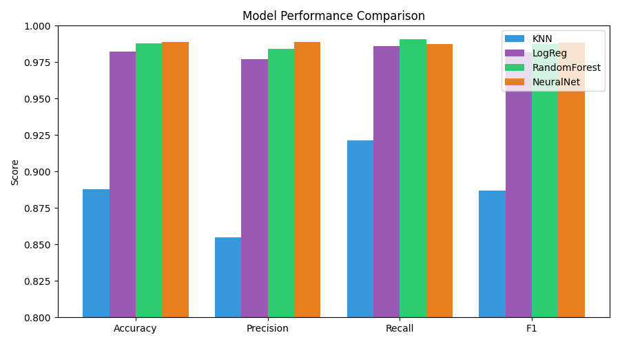
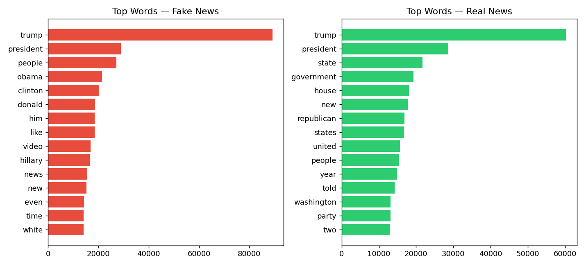

# AI-Powered Fake News Detection Using Text Classification

A machine learning pipeline that classifies news articles as **real or fake** using TF-IDF text features and four classification algorithms — built as part of the IICT AI/ML Summer Internship Program (2026).

## 📊 Results

Trained and evaluated on 44,889 real news articles ([Kaggle Fake and Real News Dataset](https://www.kaggle.com/datasets/clmentbisaillon/fake-and-real-news-dataset)):

| Model | Accuracy | Precision | Recall | F1-Score | ROC-AUC |
|---|---|---|---|---|---|
| **Neural Network (MLP)** | **98.88%** | 98.90% | 98.74% | 0.9882 | 0.9990 |
| **Random Forest** | 98.81% | 98.42% | 99.09% | 0.9876 | 0.9994 |
| **Logistic Regression** | 98.23% | 97.69% | 98.62% | 0.9815 | 0.9982 |
| **K-Nearest Neighbors** | 88.81% | 85.51% | 92.16% | 0.8871 | 0.9531 |



## 🧠 Overview

- **Problem**: Binary text classification — predict whether a news article is real or fake from its title and body text.
- **Approach**: Manual text cleaning + tokenization → TF-IDF vectorization (unigrams + bigrams, 5000 features) → 4 classifiers spanning parametric, non-parametric, ensemble, and deep learning paradigms.
- **Key design decision**: The dataset's `subject` metadata column was deliberately excluded from model input — it near-perfectly separates real/fake by tag alone, which would let the model "cheat" using a dataset artifact instead of learning genuine linguistic patterns of misinformation.

## 📁 Project Structure

```
├── week1_load_clean.py       # Data loading, merging, manual cleaning & tokenization
├── week2_features_eda.py     # Bag-of-Words, TF-IDF feature extraction, EDA
├── week3_models.py           # Trains KNN, Logistic Regression, Random Forest, Neural Net
├── week4_evaluate.py         # Confusion matrices, ROC curves, metric comparisons
├── outputs/                  # Generated charts
└── README.md
```

## 🔬 Methodology

1. **Preprocessing**: Lowercasing, URL/punctuation/digit removal, manual tokenization, custom stopword removal
2. **Feature Extraction**: TF-IDF (unigrams + bigrams, max 5000 features, min_df=3)
3. **Models**:
   - K-Nearest Neighbors (non-parametric)
   - Logistic Regression (parametric)
   - Random Forest (ensemble, 150 trees)
   - Multi-Layer Perceptron (neural network, 100 hidden units, early stopping)
4. **Evaluation**: Accuracy, Precision, Recall, F1-Score, ROC-AUC, Confusion Matrix on an 80/20 stratified train-test split

## 📈 Exploratory Insights

Fake news articles skew toward personality-driven vocabulary (*trump, obama, clinton, video*), while real news articles emphasize institutional terms (*state, government, republican, united*).



## 🛠️ Tech Stack

- Python 3
- scikit-learn
- pandas / numpy
- matplotlib

## ▶️ How to Run

```bash
pip install pandas numpy scikit-learn matplotlib

python week1_load_clean.py      # produces processed_data.csv
python week2_features_eda.py    # produces TF-IDF features + EDA charts
python week3_models.py          # trains all 4 models, saves results.json
python week4_evaluate.py        # generates evaluation charts
```

> Note: `Fake.csv` and `True.csv` from the [Kaggle dataset](https://www.kaggle.com/datasets/clmentbisaillon/fake-and-real-news-dataset) must be placed in the same directory before running `week1_load_clean.py`.

## 📄 Full Report

A complete IEEE-format project report (introduction, methodology, results, discussion, conclusion, references) is available on request / linked in the project documentation.

---

**Author**: Monika · B.Tech AI/ML, Sathyabama Institute of Science and Technology (SIST)
**Program**: IICT AI/ML Summer Internship 2026
